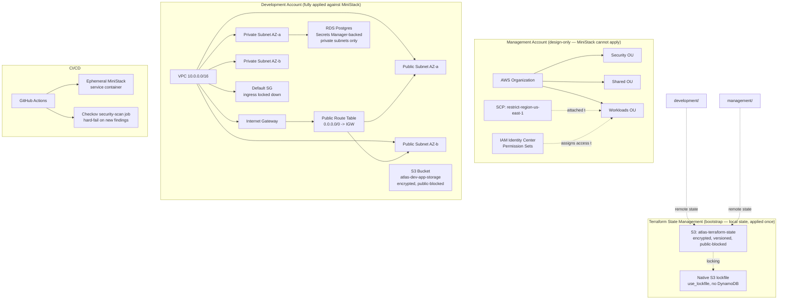

# Atlas Foundation

> The foundational repository for the Atlas cloud platform.

## Problem Statement

Standing up AWS infrastructure without a landing zone means every team
reinvents account structure, access control, and guardrails from
scratch — usually inconsistently, and usually without anyone reviewing
the security implications until an audit finds them. Atlas Foundation
solves this once: a multi-account AWS Organization, IAM Identity Center
access model, Service Control Policy guardrails, and a set of reusable,
tested Terraform modules that every other Atlas repository builds on
top of, all provable without a running production AWS bill.

## Overview

Atlas Foundation is the core infrastructure repository of the Atlas
platform. It establishes the AWS landing zone, platform governance,
reusable Terraform modules, engineering standards, and documentation
that serve as the foundation for all other Atlas repositories.

The repository is designed as a production-style infrastructure
project, following modern DevSecOps and Infrastructure as Code (IaC)
practices.

---

## Vision

Atlas aims to become a complete Internal Developer Platform (IDP) that
enables engineers to provision, secure, monitor, and operate cloud
infrastructure through automation and reusable platform components.

Atlas Foundation provides the base layer upon which the rest of the
platform is built.

---

## Objectives

- Build infrastructure using Terraform.
- Follow Infrastructure as Code best practices.
- Simulate enterprise AWS environments with MiniStack.
- Develop reusable Terraform modules.
- Apply cloud security and governance principles.
- Integrate automated testing and CI/CD.
- Document architecture and engineering decisions.

---

## Architecture Diagram



---

## Repository Structure

```text
atlas-foundation/
├── .github/
│   └── workflows/          # CI (repository validation, terraform plan, security scan)
├── docs/
│   ├── adr/                 # Architecture Decision Records
│   ├── diagrams/             # Architecture diagrams
│   ├── evidence/              # Committed proof-of-work (plan outputs, scan results)
│   ├── threat-model.md        # STRIDE threat model
│   └── incident-runbook.md    # Operational runbook
├── terraform/
│   ├── bootstrap/
│   │   └── backend/         # S3 state bucket, applied once, local state
│   ├── modules/              # Reusable Terraform modules
│   │   ├── organizations/
│   │   ├── iam/
│   │   ├── networking/
│   │   ├── policies/
│   │   ├── database/
│   │   └── storage/
│   └── environments/         # Per-account deployments
│       ├── management/       # real: org, IAM Identity Center, SCPs
│       └── development/      # real: VPC, storage, RDS
├── tests/
│   └── terratest/            # Automated infrastructure tests (Go)
├── .editorconfig
├── .gitignore
├── CHANGELOG.md
├── CONTRIBUTING.md
├── LICENSE
├── Makefile
└── README.md
```

`security`, `shared`, `staging`, and `production` environments are
intentionally not yet built — see [ADR-0014](docs/adr/ADR-0014-defer-security-shared-staging-production-environments.md).

---

## Technology Choices

| Choice | Why this, not the alternative |
|---|---|
| **Terraform** over CloudFormation/CDK | Cloud-agnostic HCL, mature module ecosystem, and the skill transfers beyond AWS — the tradeoff is a steeper learning curve than CDK's native-language approach. |
| **MiniStack** over LocalStack | LocalStack discontinued free-tier state persistence in March 2026 (ADR-0004); MiniStack is free/MIT with genuine persistence. Tradeoff: a newer, less battle-tested tool — verified independently via stop/start persistence testing rather than trusted on claims alone. |
| **Native S3 locking (`use_lockfile`)** over DynamoDB | One fewer resource to provision, secure, and pay for; requires Terraform ≥1.11 (ADR-0012). Tradeoff: DynamoDB locking is more battle-tested in the wider ecosystem as of this writing. |
| **`manage_master_user_password` (Secrets Manager)** over app-generated passwords | The database password never touches Terraform state in plaintext (ADR-0011). Tradeoff: ties credential rotation to AWS Secrets Manager conventions rather than a fully custom scheme. |
| **Checkov** over tfsec-only for CI gating | Broader AWS-specific check coverage and active SARIF/GitHub Actions integration; tfsec still run manually as a second opinion (ADR-0010). |
| **`plan`-only CI, manual `apply`** | Mirrors how real teams gate production changes — a human reviews the diff before anything is applied for real, and CI's only `apply` targets the ephemeral, throwaway MiniStack container. |

---

## Deployment Guide

**Prerequisites:** Docker, Terraform ≥1.11, Go ≥1.21 (for Terratest).

```bash
# 1. Start MiniStack (local AWS emulator)
docker run -d --name ministack -p 4566:4566 \
  -e PERSIST_STATE=1 -e S3_PERSIST=1 \
  -v ministack-data:/var/lib/ministack \
  ministackorg/ministack

# 2. Bootstrap the Terraform state backend (once, local state)
cd terraform/bootstrap/backend
terraform init
terraform apply

# 3. Deploy the development environment
cd ../../environments/development
terraform init -backend-config=backend.hcl
terraform plan
terraform apply

# 4. Deploy the management environment (org/IAM/SCPs — plan only,
#    account-and-org-level resources cannot be created by any local
#    emulator; see ADR-0007–0009)
cd ../management
terraform init -backend-config=backend.hcl
terraform plan
```

Run all checks locally before pushing (mirrors CI exactly):

```bash
make check
```

---

## CI/CD

Three jobs run on every push and PR to `main`, defined in
[`.github/workflows/ci.yml`](.github/workflows/ci.yml):

1. **`repository-check`** — fails fast if required governance files
   (README, LICENSE, CHANGELOG, etc.) are missing.
2. **`terraform-plan`** — spins up an ephemeral MiniStack service
   container, applies the bootstrap backend against it (throwaway,
   destroyed when the job ends), then runs `terraform plan` against the
   `development` environment. Never runs `apply` against anything
   persistent.
3. **`security-scan`** — runs Checkov against the full `terraform/`
   tree and hard-fails on any finding not explicitly reviewed and
   skip-listed with a cited ADR (see the comments directly in
   `ci.yml`).

---

## Current Status

Phase 1 (`atlas-foundation`) core infrastructure is complete:

- **Governance** — README, LICENSE, CONTRIBUTING, CHANGELOG, 14 ADRs
- **State management** — remote S3 state with native S3 locking
  (ADR-0012), encrypted, versioned, public-access-blocked
- **CI/CD** — three-job pipeline: repo validation, `terraform plan`
  against ephemeral MiniStack, and a hard-failing Checkov security gate
- **Reusable modules** — all four required modules (`storage`,
  `networking`, `database`, `iam`) plus `organizations` and `policies`
  are built; `storage` and `networking` are fully applied and verified
  against MiniStack, `database` is applied in `development`,
  `organizations`/`iam`/`policies` are `plan`-validated only
  (account-and-org-level AWS resources cannot be created by any local
  emulator — ADRs 0007–0009)
- **Testing** — Terratest (`make test`) applies the `storage` module
  against an isolated fixture and asserts the result via a real API call
- **Security** — Checkov runs in CI on every push; all findings are
  either fixed or explicitly deferred with a cited ADR (0010, 0013)

**Remaining, tracked honestly:**
- Automated test coverage for `networking`, `database`, `iam`, and
  `organizations` modules (currently only `storage` has a Terratest)
- `security`, `shared`, `staging`, `production` environments (ADR-0014)

---

## Design Decisions (ADRs)

Every non-trivial decision in this repository is recorded, including
decisions that were later reversed. Full history in [`docs/adr/`](docs/adr/):

| ADR | Decision |
|---|---|
| 0001 | Multi-account AWS Organization structure |
| 0002 | Layered Terraform repository structure (bootstrap/modules/environments) |
| 0003 | Accept ephemeral LocalStack state *(superseded by 0004)* |
| 0004 | Replace LocalStack with MiniStack for persistent local AWS emulation |
| 0005 | Defer migration from DynamoDB locking to native S3 locking *(superseded by 0012)* |
| 0006 | Accept MiniStack's crash-persistence gap |
| 0007 | Organizations module: design/plan-validated only |
| 0008 | IAM Identity Center module: design/plan-validated only |
| 0009 | SCPs module: design/plan-validated only |
| 0010 | Security scan findings triage |
| 0011 | Database module security hardening (Secrets Manager, no plaintext password) |
| 0012 | Migrate to native S3 locking, remove DynamoDB lock table |
| 0013 | RDS module security scan triage (Multi-AZ, monitoring, query logging deferrals) |
| 0014 | Defer security/shared/staging/production environment directories |
| 0015 | RDS second-opinion (tfsec) scan triage — backup retention, IAM auth |

---

## Threat Model

Full STRIDE analysis: [`docs/threat-model.md`](docs/threat-model.md).
Summary: the primary mitigations in place are that CI's only `apply`
targets an ephemeral, throwaway MiniStack container (never real AWS),
database credentials are Secrets-Manager-managed and never touch
Terraform state, and every infrastructure change is reviewed as a
`plan` diff in a PR before merge.

---

## Security Review

Checkov runs against the full Terraform tree on every push, hard-
failing on unreviewed findings. As of 2026-08-10: **Checkov 45 passed,
0 failed**; **tfsec (second-opinion scan, run manually) 38 passed, 16
findings (6 high, 8 medium, 2 low)** — every one of the 16 traces to a
cited ADR (0010, 0011, 0013), none are unreviewed. Full results:
[`docs/evidence/security-scans/`](docs/evidence/security-scans/),
[ADR-0010](docs/adr/ADR-0010-security-scan-triage.md),
[ADR-0013](docs/adr/ADR-0013-rds-security-scan-triage.md), and
[ADR-0015](docs/adr/ADR-0015-rds-second-scan-triage.md).

---

## Testing Strategy

Terratest ([`tests/terratest/`](tests/terratest/)) applies the
`storage` module against an isolated fixture — a dedicated root module
pinning an explicit MiniStack-only provider, so the test cannot
silently fall back to real AWS credentials — asserts the resulting
bucket exists via a real `HeadBucket` call, then tears it down. Run
with `make test`. Coverage for the remaining modules is tracked in
Current Status above.

---

## Cost Model

**$0 spent.** Every resource in this repository runs against MiniStack,
a free local AWS API emulator. Account-and-org-level resources (AWS
Organizations, IAM Identity Center, SCPs) are validated via `terraform
plan` only — these are one-time, structurally significant, account-wide
operations that no emulator (and, deliberately, no burst-deploy here)
creates for real.

---

## Incident Runbook

Full runbook: [`docs/incident-runbook.md`](docs/incident-runbook.md).
Covers: CI pipeline failures (per job), MiniStack state-persistence
gaps (ADR-0006), suspected credential leaks, and stuck state locks.

---

## Postmortem Example

**Incident:** An early Terratest run pointed directly at the bare
`storage` module. With no provider configuration of its own — correct
by module design, since modules should inherit the caller's provider —
Terraform fell back to real, ambient AWS credentials instead of
erroring. A real S3 bucket was created, and destroyed by the test's own
cleanup, in a real AWS account, in under a minute.

**Detection:** The `terraform plan` output inside the test log showed
`region = eu-west-1` and a real AWS-issued hosted zone ID — inconsistent
with MiniStack's `us-east-1` / placeholder-zone behavior seen in every
other apply.

**Resolution:** Confirmed via `aws s3 ls` (real credentials, no
emulator flag) that nothing remained. Rebuilt the test against a
dedicated fixture (`tests/terratest/fixtures/storage/`) whose only job
is to pin an explicit, MiniStack-only provider, closing the code path
that allowed the fallback.

---

## Future Roadmap

- Terratest coverage for `networking`, `database`, `iam`, `organizations`
- Build out `security`, `shared`, `staging`, `production` environments
  (ADR-0014)
- Refresh security-scan evidence to include the `database` module
- Phase 2 (`atlas-security`): OPA/Conftest, Semgrep, Trivy, Gitleaks,
  Cosign/Syft SBOM signing — see the Atlas execution plan

---

## Demo Video

[](https://asciinema.org/a/R0rrd8VAIEnHr3fB)

A live demonstration of `make check`, Terraform infrastructure
deployment against MiniStack, and the stop/start persistence proof
described in ADR-0006.

---

## Documentation

Additional documentation is available under the `docs/` directory.
Architecture decisions are recorded using ADRs in `docs/adr/`. Plan
outputs and security scan results are committed as evidence in
`docs/evidence/`.

---

## Contributing

Please read `CONTRIBUTING.md` before submitting changes.

---

## License

This project is licensed under the MIT License.