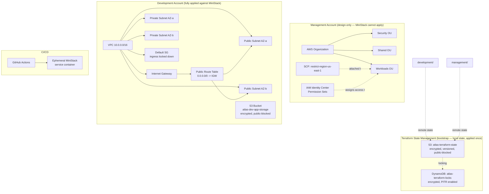

# Atlas Foundation

> The foundational repository for the Atlas cloud platform.

## Overview

Atlas Foundation is the core infrastructure repository of the Atlas platform. It establishes the AWS landing zone, platform governance, reusable Terraform modules, engineering standards, and documentation that serve as the foundation for all other Atlas repositories.

The repository is designed as a production-style infrastructure project, following modern DevSecOps and Infrastructure as Code (IaC) practices.

---

## Vision

Atlas aims to become a complete Internal Developer Platform (IDP) that enables engineers to provision, secure, monitor, and operate cloud infrastructure through automation and reusable platform components.

Atlas Foundation provides the base layer upon which the rest of the platform is built.

---

## Objectives

- Build infrastructure using Terraform.
- Follow Infrastructure as Code best practices.
- Simulate enterprise AWS environments with MiniStack.
- Develop reusable Terraform modules.
- Apply cloud security and governance principles.
- Integrate automated testing and CI/CD.
- Document architecture and engineering decisions.

---

## Architecture Diagram



---

## Repository Structure

```text
atlas-foundation/
├── .github/
│   └── workflows/          # CI (repository validation, terraform plan)
├── docs/
│   ├── adr/                 # Architecture Decision Records
│   ├── diagrams/             # Architecture diagrams
│   └── evidence/              # Committed proof-of-work (plan outputs, scan results)
├── terraform/
│   ├── bootstrap/
│   │   ├── backend/         # S3 state bucket + DynamoDB lock table
│   │   ├── providers/
│   │   └── state/
│   ├── modules/              # Reusable Terraform modules
│   │   ├── organizations/
│   │   ├── iam/
│   │   ├── networking/
│   │   ├── policies/
│   │   └── storage/
│   └── environments/         # Per-account deployments
│       ├── management/
│       ├── security/
│       ├── shared/
│       ├── development/
│       ├── staging/
│       └── production/
├── tests/
│   └── terratest/            # Automated infrastructure tests (Go)
├── .editorconfig
├── .gitignore
├── CHANGELOG.md
├── CONTRIBUTING.md
├── LICENSE
├── Makefile
└── README.md
```

---

## Technology Stack

- Terraform
- AWS
- MiniStack
- Docker
- GitHub Actions
- Go (Terratest)
- Python
- Bash

---

## Current Status

The foundation phase is substantially complete:

- **Governance** — README, LICENSE, CONTRIBUTING, CHANGELOG, 10 ADRs
- **State management** — remote S3 state + DynamoDB locking, applied and
  verified against MiniStack, encrypted and point-in-time-recoverable
- **CI/CD** — GitHub Actions runs `terraform plan` against an ephemeral
  MiniStack service container on every push/PR
- **Reusable modules** — `storage` (S3) and `networking` (VPC/subnets/
  routing) fully built, applied, and verified against MiniStack;
  `organizations`, `iam`, and `policies` built and `plan`-validated
  (account-and-org-level AWS resources cannot be created by any local
  emulator — see ADRs 0007–0009)
- **Testing** — an isolated Terratest suite (`make test`) applies the
  `storage` module against a dedicated fixture and asserts the result
  via a real API call
- **Security** — Checkov and tfsec run against the full Terraform tree;
  findings triaged, fixed where appropriate, deferred with documented
  rationale where not (ADR-0010)

Remaining for Phase 1: an RDS module (the last of the four modules
required by the roadmap), a formal threat model, and an incident
runbook.

---

## Design Decisions (ADRs)

Every non-trivial decision in this repository is recorded, including
decisions that were later reversed. Full history in [`docs/adr/`](docs/adr/):

| ADR | Decision |
|---|---|
| 0001 | Multi-account AWS Organization structure |
| 0002 | Layered Terraform repository structure (bootstrap/modules/environments) |
| 0003 | Accept ephemeral LocalStack state *(superseded by 0004)* |
| 0004 | Replace LocalStack with MiniStack for persistent local AWS emulation |
| 0005 | Defer migration from DynamoDB locking to native S3 locking *(superseded by 0012)* |
| 0012 | Migrate to native S3 locking, remove DynamoDB lock table |
| 0006 | Accept MiniStack's crash-persistence gap |
| 0007 | Organizations module: design/plan-validated only |
| 0008 | IAM Identity Center module: design/plan-validated only |
| 0009 | SCPs module: design/plan-validated only |
| 0010 | Security scan findings triage |

---

## Security Review

Checkov and tfsec run against the full Terraform tree. Full results,
before/after fixes, and triage rationale: [`docs/evidence/security-scans/`](docs/evidence/security-scans/)
and [ADR-0010](docs/adr/ADR-0010-security-scan-triage.md).

After remediation: Checkov 20→32 checks passed, tfsec high-severity
findings 22→6. Fixed: S3 public-access-blocking and encryption,
DynamoDB encryption and point-in-time recovery, VPC default-security-
group lockdown. Deferred with documented rationale: customer-managed
KMS keys, VPC flow logs, bucket access logging, lifecycle policies.

---

## Testing Strategy

Terratest ([`tests/terratest/`](tests/terratest/)) applies the `storage`
module against an isolated fixture — a dedicated root module pinning
an explicit MiniStack-only provider, so the test cannot silently fall
back to real AWS credentials — asserts the resulting bucket exists via
a real `HeadBucket` call, then tears it down. Run with `make test`.

---

## Cost Model

**$0 spent.** Every resource in this repository runs against MiniStack,
a free local AWS API emulator. Account-and-org-level resources (AWS
Organizations, IAM Identity Center, SCPs) are validated via `terraform
plan` only — these are one-time, structurally significant, account-wide
operations that no emulator (and, deliberately, no burst-deploy here)
creates for real.

---

## Postmortem Example

**Incident:** An early Terratest run pointed directly at the bare
`storage` module. With no provider configuration of its own — correct
by module design, since modules should inherit the caller's provider —
Terraform fell back to real, ambient AWS credentials instead of
erroring. A real S3 bucket was created, and destroyed by the test's own
cleanup, in a real AWS account, in under a minute.

**Detection:** The `terraform plan` output inside the test log showed
`region = eu-west-1` and a real AWS-issued hosted zone ID — inconsistent
with MiniStack's `us-east-1` / placeholder-zone behavior seen in every
other apply.

**Resolution:** Confirmed via `aws s3 ls` (real credentials, no
emulator flag) that nothing remained. Rebuilt the test against a
dedicated fixture (`tests/terratest/fixtures/storage/`) whose only job
is to pin an explicit, MiniStack-only provider, closing the code path
that allowed the fallback.

---

## Documentation

Additional documentation is available under the `docs/` directory.
Architecture decisions are recorded using ADRs in `docs/adr/`. Plan
outputs and security scan results are committed as evidence in
`docs/evidence/`.

---

## Contributing

Please read `CONTRIBUTING.md` before submitting changes.

---

## License

This project is licensed under the MIT License.